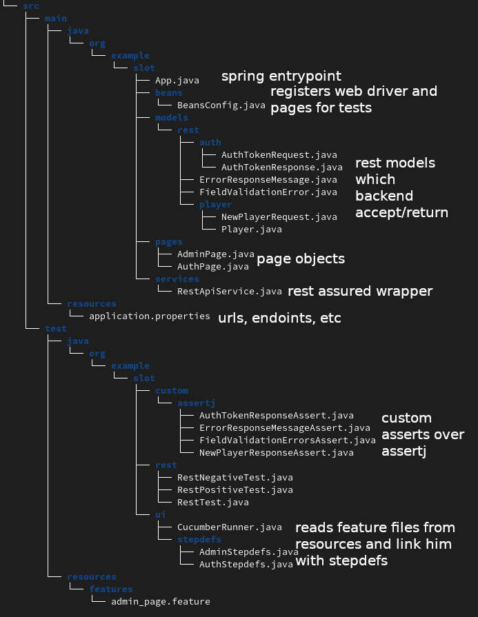

### requirements
1. java 17
2. gnu make (if run with makefile) || idea
3. maven

### startup 
* terminal
  * ui: `make ui-test`
  * rest `make rest-test`
* idea
  * ui - run cucumber runner class
  * rest - run specific class

### structure
